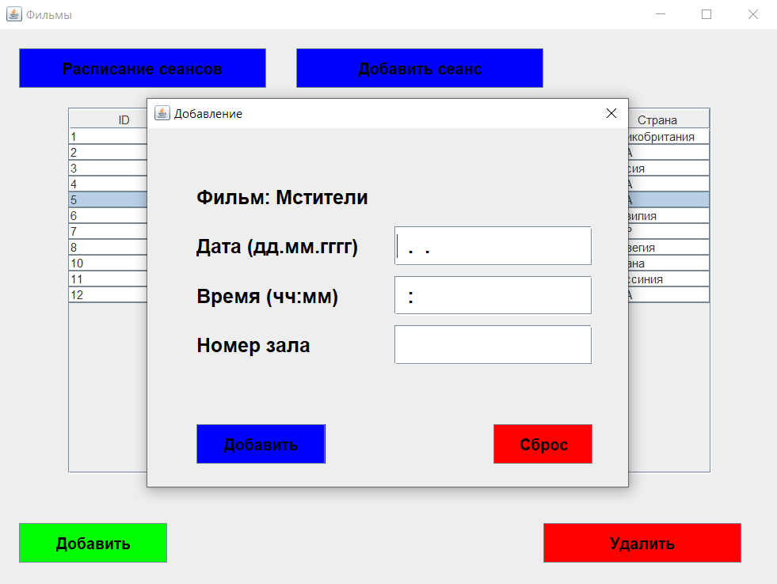

# Cinema_0371

### Емельянов Матвей и Галимуллин Амир гр.0371

## Сведения для запуска
Для запуска проекта необходимомо:
1. Скачать проект с гитхаба
2. Созадть на компьютере локальную БД postgreSQL `cinema`
3. Открыть проект с помощью среды разработки
4. Добавить созданную БД `cinema` в среду разработки
5. Запустить [`MEGAADDER.sql`](./MEGAADDER.sql) для наполнения БД
6. Изменить параметры в файле [`Server/src/main/java/Server/DatabaseConfig`](./Server/src/main/java/Server/DatabaseConfig.java) 
на пользовательские
7. Далее в описанной последовательности (т.е. сначала [`ServerStart`][1], а только потом [`Client`][2]):
   * Запустить [`ServerStart`][1]
   * Запустить [`Client`][2]
8. Радоваться жизни

## Описание

После запуска открывается окно авторизации в системе.

* После входа в систему с данными администратора открывется окно администратора.

  * При нажатии на кнопку `Добавить` открывается форма для ввода данных о новом фильме.
  
  * При выборе фильма и нажатии на кнопку `Расписание сеансов` открывается окно 
  для просмотра текущих сеансов и удаления имеющихся.
  
  * При выборе фильма и нажатии на кнопку `Добавить сеанс` открывется форма 
  для ввода данных оновом сансе на выбранный фильм.
  
* После входа в систему с данными кассира открывается окно кассира.

  * После выбора фильма открывается окно с сеансами.
  
  * После выбора сеанса открывается окно для выбора мест.
    * Красный - занятые месте
    * Синий - свободные места
  
  * Выбранные места отображаются зеленым цветом.
  
  * При нажатии на кнопку `Подтвердить` открывается окно с подтверждением
  

[1]: ./Server/src/main/java/Server/ServerStart.java
[2]: ./Client/src/main/java/Client/Client.java